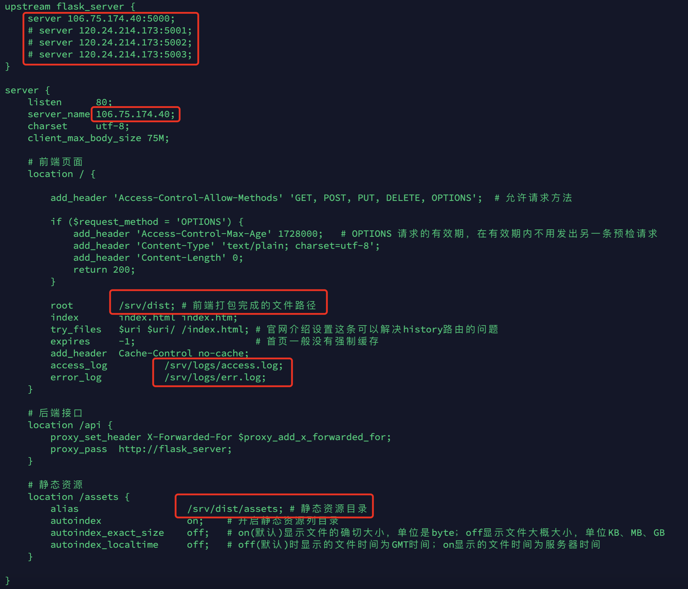

# 项目部署

### 安装`git`以及拉取项目

```shell
apt-get install git -y
git --version
```

```shell
cd /srv

web端:
    git clone https://github.com/ExileLine/ExileTestPlatformWeb.git
    
server端:
    git clone https://github.com/ExileLine/ExileTestPlatformServer.git
```

### 数据库相关

自行准备或参考如下安装

- Mysql（`5.7`，`8.0`，或以上）

    - 参考：[数据库安装](./install_mysql_or_mariadb.md)


- Redis（`5.0`，`6.0`，或以上）

    - 参考：[Redis安装](./install_redis.md)


- 配置文件(参照格式即可)

  服务器环境：`/ExileTestPlatformServer/config/pro.int`

  本地环境(自行创建)：`/ExileTestPlatformServer/config/dev.int`

### Web端部署

方法一：`本地`完成`npm`打包后放置服务器对应的目录下。

下载(推荐版本v12及以上)：[Node.js](https://nodejs.org/en)

  ```shell
  cd /目录/ExileTestPlatformWeb
  
  安装依赖:
      npm i
  
  打包生成dist文件:
      npm run build  
  
  ```  

方法二：`服务器`完成`npm`打包后放置对应的目录下。

下载(推荐版本v12及以上)：[Node.js](https://nodejs.org/en/download)

```shell
cd /目录/ExileTestPlatformWeb

安装依赖:
npm i

打包生成dist文件:
npm run build  
``` 

### Server端部署

#### 安装相关依赖

`Debian(9,10,11)` 或 `Ubuntu(18,20,21)`

```shell
sudo apt update -y
sudo apt-get update
sudo apt-get upgrade -y
sudo apt install wget
sudo apt install gcc -y
sudo apt install build-essential zlib1g-dev libssl-dev libncurses5-dev libreadline-dev libgdbm-dev libnss3-dev libffi-dev -y
```

`CentOS(7)`

```shell
sudo yum update
sudo yum -y install wget gcc atuomake
sudo yum -y install devtoolset-9-gcc devtoolset-9-gcc-c++ devtoolset-9-binutils
sudo yum -y install zlib-devel bzip2-devel openssl-devel ncurses-devel sqlite-devel readline-devel tk-devel gdbm-devel db4-devel libpcap-devel xz-devel python3-devel libffi-devel epel-release centos-release-scl
sudo yum install -y gcc-c++ libstdc++-static ant cmake byacc flex automake libtool binutils-devel bison ncurses-devel gcc kernel-devel libatomic
```

#### 安装Python3.9

- [传送门](./install_python.md)

#### 安装`Pipenv`虚拟环境管理

PS：如果使用非`3.9`版本，则需要修改 `/ExileTestPlatformServer/Pipfile` 中的 `python_version`版本号后继续往后的操作

```shell
pip install pipenv
或:
pip install pipenv -i https://pypi.doubanio.com/simple
```

#### 安装`Celery`异步任务

```shell
pip install celery
或:
pip install celery -i https://pypi.doubanio.com/simple
```

#### 安装项目依赖

```shell
cd /ExileTestPlatformServer
pipenv install
```

#### 安装`Nginx`以及配置文件

```shell
安装:
    apt-get install nginx -y

查看版本:
    nginx -v
```

```shell
开启端口:
    iptables -I INPUT -p tcp --dport 80 -j ACCEPT
    iptables -I INPUT -p tcp --dport 5000 -j ACCEPT
```

参照下图修改`/ExileTestPlatformServer/exile_nginx_for_server.conf`配置文件，复制到服务器`/etc/nginx/conf.d`中，涉及路劲需要先创建
如：`mkdir /srv/logs`

- 

    ```shell
    检查配置文件:
        nginx -t
  
    重启Nginx:
        nginx -s reload
    ```

#### Docker部署

- 安装`Docker`并部署以及`Dockerfile`
  ```shell
  安装:
      wget -qO- https://get.docker.com/ | sh
  
  查看版本:
      docker -v
  ```
- 配置国内源加速以及日志大小限制

  ```shell
  vim /etc/docker/daemon.json
  
  {
          "registry-mirrors" : [
                     "https://mirror.ccs.tencentyun.com",
                     "http://registry.docker-cn.com",
                     "http://docker.mirrors.ustc.edu.cn",
                     "http://hub-mirror.c.163.com"
                   ],
          "insecure-registries" : [
                     "registry.docker-cn.com",
                     "docker.mirrors.ustc.edu.cn"
                   ],
          "debug" : true,
          "experimental" : true,
          "log-driver":"json-file",
          "log-opts": {"max-size":"500m", "max-file":"3"}
  }
  
  wq保存
  
  systemctl daemon-reload
  systemctl restart docker
  ```

### 启动相关

#### 使用Docker启动

- 启动`Docker`
  快捷启动脚本 `/ExileTestPlatformServer/server_start.sh` [传送门](https://github.com/ExileLine/ExileTestPlatformServer/blob/main/server_start.sh)

  ```shell
  cd /目录/ExileTestPlatformServer
  sh server_start.sh
  ```

#### 启动`Celery`异步任务

```shell
cd /目录/ExileTestPlatformServer

进入env:
    pipenv shell
```

后台启动例子，其他启动命令查阅 `/ExileTestPlatformServer/celery_app.py` [传送门](https://github.com/ExileLine/ExileTestPlatformServer/blob/main/celery_app.py)

```shell
先创建好目录，如：/srv/logs

celery -A celery_app.cel multi start worker --pidfile="/srv/logs/celery/%n.pid" --logfile="/srv/logs/celery/%n%I.log"
```

### 备注

- 查阅相关文章
    - https://juejin.cn/post/6844903870250876935
    - https://juejin.cn/post/7054460759526342687
  
